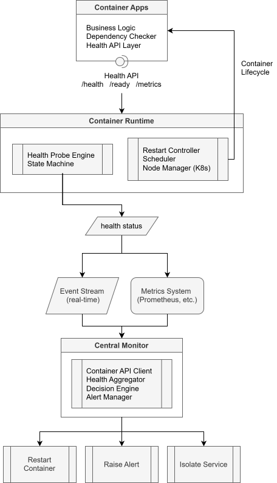

# Containerized System Health Monitoring Design Guide｜容器化系統健康監控設計指南

  

## Overview｜概述


Defines a **layered health monitoring architecture for containerized systems**, focusing on **observability, self-healing, and cross-service coordination**.  
定義一個**分層式容器化系統健康監控架構**，專注於**可觀測性、自動修復與跨服務協調**。


**Key Concepts｜關鍵概念**

* Containers introduce｜容器帶來以下特性

  * **Isolation** (per-service boundary)  
    **隔離性**（每個服務邊界獨立）
  * **Dynamic lifecycle** (ephemeral instances)  
    **動態生命週期**（短暫實例）
  * **Decoupled deployment**  
    **解耦部署**

* Challenges｜挑戰

  * Visibility is **fragmented**  
    可視性**碎片化**
  * Dependencies are **externalized**  
    相依性**外部化**
  * Recovery must be **coordinated**  
    復原需**協調進行**


**Example｜範例**

In Kubernetes:  
在 Kubernetes 中：

* Pod is running → OK at runtime level  
  Pod 運行中 → 執行時層級正常
* DB connection fails → detected at `/ready`  
  DB 連線失敗 → 由 `/ready` 偵測
* Pod restarted automatically → via `livenessProbe`  
  Pod 自動重啟 → 透過 `livenessProbe`
* Repeated failures → detected by central monitor  
  重複失敗 → 由中央監控偵測


**Architecture｜架構**

```
+----------------------------------+
| Container Health Model           |
|----------------------------------|
| L6 Metrics & Observability       |
| L5 Event-driven monitoring       |
| L4 Central Monitor               |
| L3 Self-healing policy           |
| L2 Application Health API        |
| L1 Runtime Health Checks         |
+----------------------------------+
```


## Recommended Monitoring Layers｜建議監控層級

### Layer 1 – Container Runtime Health Check｜第1層 – 容器執行環境健康檢查


Provides **basic container-level health validation**, acting as the **entry point for failure detection inside containers**.  
提供**基本容器層級健康驗證**，作為**容器內故障偵測的入口點**。


**Key Concepts｜關鍵概念**

* Native to container platforms：  
  容器平台內建：

  * Docker `HEALTHCHECK`
  * K8s `livenessProbe`, `readinessProbe`

* Evaluates service via **external probe (HTTP/command)**  
  透過 **外部探測（HTTP 或指令）** 評估服務狀態


**Example｜範例**

```dockerfile
# Dockerfile
HEALTHCHECK --interval=10s --timeout=3s --retries=3 \
  CMD curl -f http://localhost:8080/health || exit 1
```

Result｜結果

```
docker ps
# STATUS: healthy / unhealthy
```


**Behavior｜行為**

```
IF healthcheck fails N times → mark unhealthy
若健康檢查失敗 N 次 → 標記為 unhealthy

IF livenessProbe fails → restart container
若 livenessProbe 失敗 → 重啟容器
```

**Design Insight｜設計重點**

* This replaces **systemd (Layer 1 in native system)**  
  取代原生系統中的 **systemd（第1層）**
* Works at **container boundary level**  
  運作於**容器邊界層級**


### Layer 2 – Application Health API｜第2層 – 應用程式健康 API


Ensures **functional correctness and dependency readiness**, not just container liveness.  
確保**功能正確性與依賴可用性**，不僅是容器是否存活。


**Key Concepts｜關鍵概念**

* Standard endpoints｜標準端點：

  * `/health` → liveness｜存活
  * `/ready` → readiness｜就緒
  * `/metrics` → performance｜效能

* Verifies｜驗證項目

  * Database｜資料庫
  * External services｜外部服務
  * Internal state｜內部狀態


**Example｜範例**

```json
{
  "status": "degraded",
  "db": "connected",
  "sensor": "timeout"
}
```


**Behavior｜行為**

```
IF dependency not ready → fail readiness
若依賴未就緒 → readiness 失敗

IF logic degraded → return "degraded"
若邏輯降級 → 回傳 "degraded"
```


### Layer 3 – Self-Healing Policy｜第3層 – 自動修復策略


Provides **automatic recovery from failures**, driven by runtime or orchestrator policies.  
透過執行環境或編排器策略提供**自動故障恢復**。


**Key Concepts｜關鍵概念**

* Restart mechanisms｜重啟機制

  * Docker: `restart: always`
  * Kubernetes: `restartPolicy: Always`

* Behavior scope｜行為範圍

  * Container restart｜容器重啟
  * Replace container｜替換容器
  * Node rescheduling｜節點重新調度


**Behavior｜行為**

```
IF container crashes → restart
容器崩潰 → 重啟

IF unhealthy → recreate container
容器 unhealthy → 重建

IF node fails → reschedule pod
節點失效 → 重新調度 Pod
```

**Design Insight｜設計重點**

* Only reacts to **local container state**  
  僅反應**本地容器狀態**


### Layer 4 – Centralized Health Monitor｜第4層 – 集中式健康監控


Provides **system-wide visibility and decision-making**, enabling **cross-container intelligence**.  
提供**系統範圍內的可視性和決策能力**，實現**跨容器智慧**。

**Key Concepts｜關鍵概念**

* Aggregates｜聚合資料

  * Container status｜容器狀態
  * Health APIs
  * Metrics｜指標
  * Events｜事件

* Enables｜能力

  * Policy-based recovery｜策略驅動復原
  * Dependency-aware decisions｜依賴感知決策


**Behavior｜行為**

```
IF container unhealthy → restart
IF repeated failure → alert
IF dependency failure → isolate service
IF system-wide issue → fallback
```

### Layer 5 – Event-Driven Monitoring｜第5層 – 事件驅動監控


Provides **real-time system awareness** using event streams instead of polling.  
以事件流提供**即時監控能力**，取代輪詢。


**Key Concepts｜關鍵概念**

* Event sources｜事件來源

  * Docker events
  * Kubernetes Watch API

* Benefits｜優點

  * Low latency｜低延遲
  * Reduced polling overhead｜降低輪詢成本


**Behavior｜行為**

```
ON restart burst → immediate alert
ON health change → trigger analysis
ON container restart → log + analyze
ON repeated failures → trigger escalation immediately
```


**Flow｜流程**

```
Container Runtime → Event stream → Central Monitor
```


### Layer 6 – Metrics & Observability｜第6層 – 指標與可觀測性


Enables **deep insight and predictive monitoring**, beyond binary health states.  
提供**深度分析與預測能力**，超越單純健康狀態判斷。


**Key Concepts｜關鍵概念**

* Metrics｜指標

  * CPU / Memory
  * I/O
  * Latency
  * Error rate

* Tools：

  * Prometheus
  * Netdata
  * cAdvisor


**Behavior｜行為**

```
IF memory leak trend → preempt restart
IF latency spike → scale/throttle
```


**Data Flow｜資料流**

```
Container → Metrics Exporter → Prometheus → Monitor
```


## Data Flow Architecture｜資料流架構

Shows how **health signals propagate and trigger actions**.  
呈現健康訊號如何傳遞與觸發行動




## Failure Coverage Mapping｜故障覆蓋對應

Maps failure types to detection layers, ensuring **complete observability coverage**.  
將故障類型對應到偵測層，確保**完全可觀測性覆蓋**。  

| Failure Type<br>故障類型 | Detection Path<br>偵測層   |
| ------------------- | -------------- |
| Container crash<br>容器崩潰 | Layer 3<br>第3層   |
| App failure<br>應用異常 | Layer 1 + 2<br>第1+2層 |
| Dependency failure<br>依賴失效 | Layer 2<br>第2層   |
| Restart loop<br>重啟迴圈 | Layer 4 + 5<br>第4+5層 |
| Resource exhaustion<br>資源耗盡 | Layer 6<br>第6層   |


## Best Practice Summary｜最佳實務總結

Defines **minimum required controls** for production-grade reliability.  
定義生產級可靠性所需的**最低控制要求**。  

| Feature<br>功能      | Required<br>必要性 | Reason<br>原因    |
| -------------------- | ------------ |----------------- | 
| Runtime health check<br>執行時健康檢查 | Must<br>必須  | Detect failure<br>偵測錯誤  |
| `/health` API<br>健康 API  |  Must<br>必須  | Logic correctness<br>邏輯正確性 |
| Self-healing<br>自動修復    |  Must<br>必須  | Auto recovery<br>自動復原  |
| Central monitor<br>中央監控    |  Yes<br>建議  | Coordination<br>系統協調  |
| Metrics<br>指標監控    |  Recommended<br>建議  | Insights<br>效能分析  |

---

# License｜授權條款

  
Containerized System Health Monitoring Design Guide © 2026 by Jen Yuan Pan is licensed under [Attribution-NonCommercial-ShareAlike 4.0 International](https://creativecommons.org/licenses/by-nc-sa/4.0/legalcode.en).  
容器化系統健康監控設計指南 © 2026 作者 潘貞元（Reta Pan），依 [姓名-非商業性-相同方式分享 4.0 國際](https://creativecommons.org/licenses/by-nc-sa/4.0/legalcode.en) 授權。  

---

> [!note]  
> **AI Translation Notice | AI 翻譯說明**  
> The Chinese content of this document has been generated through AI-based translation and is presented using Traditional Chinese characters and terminology commonly used in Taiwan to ensure clarity, localization, and readability.  
> 本文之中文內容係由人工智慧（AI）翻譯產出，並採用正體中文及台灣常用語彙進行表述，以確保內容符合在地語言之使用與閱讀習慣。  
