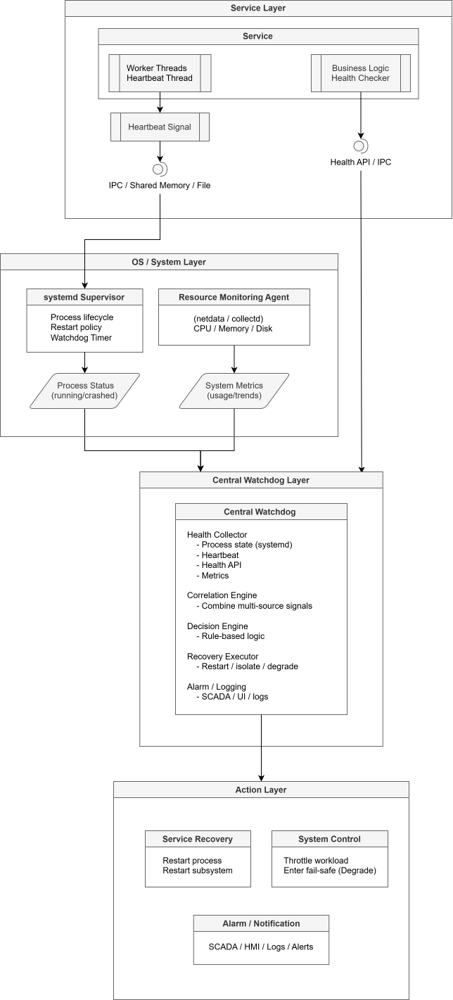

# Normal System Health Monitoring Design Guide｜一般系統健康監控設計指南

  


## Overview｜概述

**Summary｜摘要**

This guide defines a **multi-layer health monitoring architecture** for non-containerized systems, ensuring reliability across **process, logic, and system levels**.  
本指南定義一個**多層式健康監控架構**，適用於非容器化系統，確保在**程序、邏輯與系統層級**的可靠性。


**Key Concepts｜關鍵概念**

* Monitoring must go beyond “process alive”  
  監控必須超越「程序仍在執行」

* Coverage includes｜監控範圍包含：

  * **Liveness** (is it running?)  
    **存活性**（是否仍在運行）
  * **Correctness** (is it behaving correctly?)  
    **正確性**（行為是否正確）
  * **Resources** (is it sustainable?)  
    **資源**（是否可持續）
  * **Dependencies** (are upstream/downstream systems OK?)  
    **相依性**（上下游系統是否正常）

* Uses **layered defense (defense-in-depth)**  
  採用**分層防禦（縱深防禦）**

**Architecture｜架構**

```
+-----------------------------+
| Multi-Layer Monitoring      |
|-----------------------------|
| Layer 5: Central Watchdog   |
| Layer 4: Resource Monitor   |
| Layer 3: Functional Health  |
| Layer 2: Heartbeat          |
| Layer 1: Process Supervision|
+-----------------------------+
```


**Example｜範例**

A robot controller process：  
機器人控制程序：

* Running → OK at Layer 1  
  運行中 → 第1層判定正常
* Frozen → detected by Layer 2  
  凍結 → 第2層偵測
* Sensor timeout → detected by Layer 3  
  感測器逾時 → 第3層偵測
* Memory leak → detected by Layer 4  
  記憶體洩漏 → 第4層偵測


## Recommended Monitoring Layers｜建議監控層級
### Layer 1 – Process Supervision｜第1層 – 程序監控

**Summary｜摘要**

Ensures **process availability** through automatic restart and crash detection.  
透過自動重啟與崩潰偵測，確保**程序可用性**。


**Key Concepts｜關鍵概念**

* Tools｜工具

  * `systemd`
  * Custom supervisor｜自訂監控程序

* Detectable failures｜可偵測的錯誤

  * Process exit｜程序結束
  * Segmentation fault｜記憶體錯誤
  * Watchdog timeout｜看門狗逾時

* Limitation｜限制

  * Cannot detect logic failures or freezes  
    無法偵測邏輯錯誤或凍結狀態


**Example｜範例**

```ini
[Service]
ExecStart=/usr/bin/my_service
Restart=always
RestartSec=3
WatchdogSec=10
```


**Behavior｜行為**

```
IF process exits → restart
程序結束 → 重啟

IF watchdog timeout → force restart
Watchdog 逾時 → 強制重啟
```


**Design Insight｜設計重點**

* This is the **first line of defense**  
  這是**第一道防線**
* Covers **process-level failures only**  
  僅涵蓋**程序層級錯誤**


### Layer 2 – Internal Watchdog / Heartbeat｜第2層 – 內部看門狗／心跳機制

**Summary｜摘要**

Detects **“alive but unhealthy” states** such as deadlocks and freezes.  
偵測 **「仍存活但不健康」** 的狀態，例如死鎖或凍結。


**Key Concepts｜關鍵概念**

* Heartbeat = periodic signal from service  
  心跳 = 服務定期發送的訊號

* Mechanisms｜機制

  * IPC ( Inter-Process Communication) channel ｜行程間通訊
  * Shared memory｜共享記憶體
  * File timestamp｜檔案時間戳

* Detects｜可偵測

  * Deadlock｜死鎖
  * Infinite loop｜無窮迴圈
  * Thread starvation｜執行緒飢餓


**Example｜範例**

```cpp
while (running) {
    send_heartbeat();
    sleep(1);
}
```


**Behavior｜行為**

```
IF heartbeat stops → mark unhealthy
心跳停止 → 判定不健康
```


**Design Insight｜設計重點**

* Complements systemd｜補足 systemd
* Critical for **real-time control systems (robot/EFEM)**  
對即時控制系統（機器人/EFEM）至關重要

### Layer 3 – Functional Health Check｜第3層 – 功能性健康檢查

**Summary｜摘要**

Validates whether the service is **functionally correct**, not just running.  
驗證服務是否**功能正確**，而不只是正在運行。


**Key Concepts｜關鍵概念**

* Health interface｜健康檢查介面

  * HTTP (`/health`)
  * IPC interface

* Checks｜檢查項目

  * DB connectivity｜資料庫連線
  * Sensors / PLC / robot status｜設備狀態
  * Queue/backlog｜佇列狀態

* Detects｜偵測

  * “Running but wrong” failures (**most dangerous**)  
  「運行但錯誤」的故障（**最危險**）


**Example｜範例**

```bash
curl http://localhost:8080/health
```


**Response｜回應**

```json
{
  "status": "degraded",
  "db": "connected",
  "sensor": "timeout",
  "queue": "backlog_high"
}
```


**Behavior｜行為**

```
IF functional failure → restart OR isolate dependency
功能異常 → 重啟或隔離依賴
```


**Design Insight｜設計重點**

* Most important layer｜最重要層
* Detects critical hidden failures｜偵測隱性錯誤


### Layer 4 – System Resource Monitoring｜第4層 – 系統資源監控

**Summary｜摘要**

Ensures system stability by monitoring **resource usage trends**.  
透過監控**資源使用趨勢**確保系統穩定。


**Key Concepts｜關鍵概念**

* Metrics｜指標

  * CPU / Memory
  * Disk I/O
  * Network latency

* Tools｜工具

  * `netdata`
  * `collectd`

* Detects｜檢測
  * Resource exhaustion｜資源耗盡
  * Performance bottlenecks｜效能瓶頸
  

**Behavior｜行為**

```
IF memory increases steadily → memory leak
IF CPU > 90% → alert or throttle
```


**Flow｜流程**

```
System Metrics → Monitoring Agent → Central Watchdog
```


**Design Insight｜設計重點**

* Prevents cascading failures｜預防連鎖故障
* Suitable for industrial long-running systems｜適用長時間運行系統


### Layer 5 – Central Watchdog｜第5層 – 中央監控

**Summary｜摘要**

Acts as the **decision-making core**, coordinating all monitoring layers.  
作為**決策核心**，整合所有監控層資訊。


**Key Concepts｜關鍵概念**

* Aggregates｜聚合

  * Process state｜程序狀態
  * Heartbeat｜心跳
  * Functional health｜功能檢查
  * Resource metrics｜資源指標


* Core modules｜核心模組

  * Health Collector｜健康收集
  * Decision Engine｜決策引擎
  * Recovery Executor｜復原執行
  * Alarm System｜告警系統

* Supports escalation and fail-safe logic  
支援升級和故障安全邏輯

**Behavior｜行為**

```
IF process_down → restart
IF heartbeat_missing → restart
IF functional_fail → restart_service
IF repeated_failures → raise_alarm
IF overload → degrade_service
```

## Data Flow Architecture｜資料流架構




## Recommended Stack｜建議技術組合

| Layer<br>層級   | Tool<br>工具             |
| ------------ |  -------------- |
| Supervisor<br>程序監控 | systemd|
| Monitoring<br>資源監控 | netdata  |
| Health check<br>健康檢查 | custom API / IPC<br>自訂 API / IPC   |
| Watchdog<br>中央監控 | systemd / daemon<br>systemd / 自訂服務 |


## Failure Coverage Mapping｜故障覆蓋對應

Each layer is responsible for a specific failure class, ensuring **no blind spots**.  
每一層都負責特定的故障類型，確保**無盲點**。

* Layered mapping prevents single-point monitoring failure  
分層映射可防止單點監控故障  
* Coverage ensures both **fast detection** and **correct diagnosis**  
覆蓋範圍確保**快速偵測**和**正確診斷**。  

| Failure<br>故障 | Layer<br>層級   | Action<br>動作   |
| --- | --- | ---|
| Process crash<br>程序崩潰        | → L1 | → Restart<br>重啟 |  
| Deadlock<br>死鎖            | → L2 | → Restart<br>重啟 |
| Functional failure<br>功能異常 |  → L3 | → Restart / isolate<br>重啟 / 隔離 |
| Resource exhaustion<br>資源耗盡 |  → L4 | → Throttle / restart<br>降載 / 重啟 |
| System-wide issues<br>系統級問題 | → L5 | → Escalation / fail-safe<br>升級處理 / 保護模式 |


## Design Insight｜設計重點

This architecture provides **industrial-grade reliability** through：  
此架構透過以下方式達到**工業級可靠性**：

* **Layered observability**｜分層可觀測性
* **Progressive fault detection**｜漸進式故障偵測
* **Centralized decision making**｜集中決策

---

# License｜授權條款

  
Normal System Health Monitoring Design Guide © 2026 by Jen Yuan Pan is licensed under [Attribution-NonCommercial-ShareAlike 4.0 International](https://creativecommons.org/licenses/by-nc-sa/4.0/legalcode.en).  
一般系統健康監控設計指南 © 2026 作者 潘貞元（Reta Pan），依 [姓名-非商業性-相同方式分享 4.0 國際](https://creativecommons.org/licenses/by-nc-sa/4.0/legalcode.en) 授權。  

---

> [!note]  
> **AI Translation Notice | AI 翻譯說明**  
> The Chinese content of this document has been generated through AI-based translation and is presented using Traditional Chinese characters and terminology commonly used in Taiwan to ensure clarity, localization, and readability.  
> 本文之中文內容係由人工智慧（AI）翻譯產出，並採用正體中文及台灣常用語彙進行表述，以確保內容符合在地語言之使用與閱讀習慣。  
