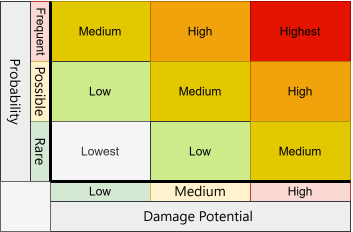
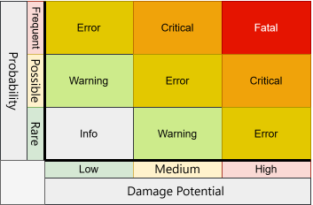

# Priority | 重要性權重

  

## Evaluation | 評估

Priority should be calculated according to Damage Potential and Probability fields.  
重要性權重，應依據「損害影響」與「發生機率」欄位計算。  

Damage Potential and Probability shall be defined based on objective and measurable criteria to ensure consistency and traceability of the assessment results.  
「損害影響」與「發生機率」應依客觀且可量化之指標進行層級定義，以確保評估結果具一致性與可追溯性。　　

### Bug and Customer Issue types | 「缺失」、「客戶問題」類型  
   

### Log type | 日誌類型  
   

## Probability | 發生機率

In particular, the classification of Probability should be established according to system characteristics and reliability requirements. It is recommended to adopt a unified measurement basis—such as event frequency (e.g., occurrences per hour) or failure rate—to avoid inconsistencies caused by mixing different scales.  
「發生機率」之分級應依系統特性與可靠度需求訂定，並建議採用統一量測單位 -- 如事件發生頻率（例如以每小時計） 或 故障率 -- 進行定義，以避免不同尺度混用所造成之誤差。　　

For example:   
例如：　　 

- In high-reliability systems such as banking transaction platforms, even extremely low-frequency anomalies (e.g., occurring within seconds or after a small number of transactions) may be classified as Frequent.  
對於高可靠度需求之銀行交易系統，即使極低頻率之異常（如每數秒或少量交易即發生）亦可歸類為 Frequent。  
- In contrast, for fault-tolerant systems such as data centers, a lower frequency of anomalies (e.g., once per day) may still be classified as Frequent.  
相較之下，對於具備容錯設計之資料中心系統，則可接受較低頻率之異常（如每日一次）歸類為 Frequent。  

Therefore, the classification of Probability should be adapted to the application context, while maintaining a consistent measurement basis and grading logic within the same system.  
因此，「發生機率」之分類標準應依應用情境調整，並於同一系統內維持一致之量測基準與分級邏輯。

## Damage Potential | 損害影響

<table>
<tr>
<th>

**Level 程度**

<figure></figure></th>
<th>

**Description 說明**

<figure></figure></th>
<th>

**Example Cases 舉例**

<figure></figure></th>
<th>

**Robot Device 設備例**

<figure></figure></th>
</tr>
<tr>
<th>

**High 高**
</th>
<td>

Severe impact on system stability or data integrity. Causes major disruption. 對系統穩定性或資料完整性造成嚴重影響，導致重大中斷。
</td>
<td>

* System crash or freeze\
  系統當機或凍結
* Data loss or corruption\
  資料遺失或毀損
* Security breach enabling unauthorized access\
  資安漏洞導致未授權存取
* Application becomes completely unusable\
  應用程式完全無法使用
</td>
<td>

* **Uncontrolled or unexpected motion** (e.g., axis runs beyond limits due to control loop bug)\
  非受控或意外的運動（例如：控制迴路錯誤導致軸超出極限）
* **Emergency stop failure** or e-stop not latched correctly due to software state bug\
  緊急停止失效，或因軟體狀態錯誤導致 e-stop 未正確鎖定
* **Collision with humans/equipment** caused by faulty path planning or obstacle detection logic\
  與人員／設備發生碰撞，起因於路徑規劃或障礙物偵測邏輯錯誤
* **Brake release at wrong time**; robot drops payload or joint falls under gravity\
  煞車於錯誤時間釋放；機器人掉落載荷或關節受重力下墜
* **Safety-rated monitored stop not engaging** when protective stop is triggered\
  當觸發保護性停機時，具安全等級的監控停機未正確啟動
* **Incorrect tool center point (TCP) or frame transform** causing misplacement and equipment damage\
  工具中心點（TCP）或座標轉換錯誤，導致放置錯誤並損壞設備
* **AGV/AMR routing failure** leading to traffic deadlock or crash\
  AGV／AMR 路徑規劃失敗，導致傳輸死結或系統崩潰
</td>
</tr>
<tr>
<th>

**Medium 中**
</th>
<td>

Noticeable degradation of functionality but system remains partially usable. 功能明顯退化，但系統仍可部分使用。
</td>
<td>

* Critical feature fails (e.g., payment processing stops)\
  關鍵功能失效（例如：付款流程中止）
* Performance degradation (e.g., slow response)\
  效能下降（例如：反應變慢）
* Temporary service outage requiring restart\
  服務暫時中斷，需要重新啟動
</td>
<td>

* **Gripper fails to actuate** intermittently; drops parts or requires manual intervention\
  夾具間歇性無法動作；掉落零件或需要人工介入
* **Calibration drift** (vision/force sensors) causing repeated mis-picks or misalignment\
  校正漂移（視覺／力覺感測器），造成持續誤抓或位置偏移
* **Tool change sequence mis-order** (requires re-run but safe state maintained)\
  工具切換流程順序錯誤（需要重新執行流程，但仍維持安全狀態）
* **Teach pendant UI lag** causing delayed jog/command execution\
  示教器介面延遲，導致點動或指令執行延後
* **Robot program step skip** due to state machine bug; cycle halts until operator reset\
  機器人程式步驟被跳過，因狀態機錯誤導致；循環暫停，直到操作員重置
* **Speed limit misapplied** (e.g., capped at 50%); throughput reduced but safe\
  速度上限被錯誤套用（例如：被限制在 50%）；產能降低但仍處於安全狀態
* **AMR localization jitter** leading to docking retries and productivity loss\
  AMR 定位抖動，導致多次對位重試與生產力下降

</td>
</tr>
<tr>
<th>

**Low 低**
</th>
<td>

Minor inconvenience with little to no impact on core functionality. 對核心功能幾乎沒有影響，只造成些微不便。
</td>
<td>

* UI glitches (misaligned buttons)\
  介面小瑕疵（按鈕未對齊）
* Non-critical error messages\
  非關鍵的錯誤訊息
* Minor performance lag\
  輕微的效能延遲
* Cosmetic issues like incorrect icons\
  外觀問題，例如圖示不正確

</td>
<td>

* **Status indicator mismatch** (e.g., light tower shows amber instead of green)\
  狀態指示燈號不一致（例如：訊號塔應顯示綠燈卻變成黃燈）
* **Non-critical alarm text typo** or poor localization on HMI\
  非關鍵警報文字有錯字，或 HMI 在地化翻譯品質不佳
* **Log timestamps off by seconds**; audit still reliable\
  紀錄檔時間戳記有數秒誤差，但稽核仍具可信度
* **Cycle counter not updating** on dashboard while actual cycle runs correctly\
  儀表板上的循環計數未更新，但實際循環執行正常
* **Tooltip/help panel incorrect** on teach pendant; no effect on motion\
  示教器上的工具提示／說明面板內容不正確，但不影響機器人動作
* **AMR map rendering artifact**; navigation unaffected\
  AMR 地圖顯示出現瑕疵或殘影，但導航功能不受影響

</td>
</tr>
</table>

---

# License｜授權條款

  
Priority © 2025 by Jen Yuan Pan is licensed under [Attribution-NonCommercial-ShareAlike 4.0 International](https://creativecommons.org/licenses/by-nc-sa/4.0/legalcode.en).  
重要性權重 © 2025 作者 潘貞元（Reta Pan），依 [姓名-非商業性-相同方式分享 4.0 國際版](https://creativecommons.org/licenses/by-nc-sa/4.0/legalcode.en) 授權。  

---

> [!note]  
> **AI Translation Notice | AI 翻譯說明**  
> The Chinese content of this document has been generated through AI-based translation and is presented using Traditional Chinese characters and terminology commonly used in Taiwan to ensure clarity, localization, and readability.  
> 本文之中文內容係由人工智慧（AI）翻譯產出，並採用正體中文及台灣常用語彙進行表述，以確保內容符合在地語言之使用與閱讀習慣。  