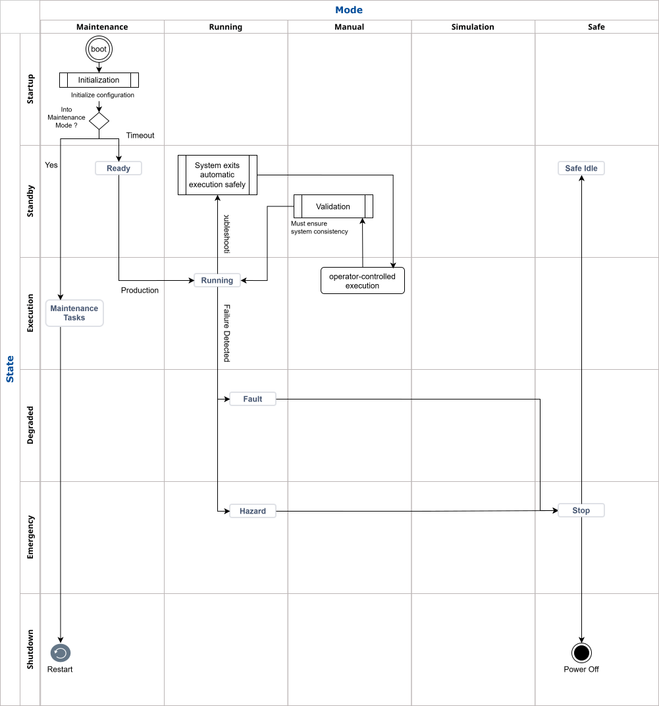

# System Mode and State ｜ 系統模式與狀態  

  

## Overview ｜ 概述

Understanding and clearly defining **System Modes** and **System States** is essential for robust requirement analysis.  
理解並清楚定義**系統模式（System Modes）** 與**系統狀態（System States）** ，是建立穩健需求分析的關鍵。

This ensures the system behaves predictably under all circumstances, supports troubleshooting, and meets both operational and safety requirements.  
這可確保系統在各種情境下皆能可預測地運作，支援故障排除，並同時滿足營運與安全需求。

> [!note]   
> * A well-designed system should define at least three distinct Modes, each with its own set of States. (A system with only a single state is generally considered a poor design in software engineering.)  
  一個良好設計的系統應至少定義三種不同的模式，每個模式各自包含一組狀態。（僅有單一狀態的系統通常被視為不良設計）  
> * Both Modes and States should clearly **specify their respective capabilities and restrictions**. This approach is fundamental to building **quality-assurable** systems.  
  模式與狀態應明確**定義其能力與限制**，這是建構**可驗證品質系統**的基礎。  
> * Properly defined Modes and States **control what the system is allowed to do**, rather than merely reflecting its current activity.  
  妥善定義的模式與狀態應**控制系統可執行的行為**，而不只是反映目前狀態。  
 


## System Modes ｜ 系統模式

System modes describe the overall operational context or intent of the system.  
系統模式描述系統的整體運行情境或操作意圖。

Each mode has distinct priorities, restrictions, and available features.  
每種模式皆具有不同的優先順序、限制與功能。

Common modes include:  
常見模式包括：


- **Running Mode (Auto Operation) ｜ 運行模式（自動運轉）** 
    * System delivers normal services to users.  
    系統提供正常服務
    * Prioritizes stability, safety, and performance.  
    優先考量穩定性、安全性與效能
    * Minimal logging (only errors or critical events).  
    最小化記錄（僅保留錯誤或關鍵事件）
    * Debugging tools and test hooks are disabled.  
    停用除錯工具與測試掛鉤
    * Optimized for high availability and monitoring.  
    針對高可用性與監控進行最佳化
    * No debug overhead for maximum efficiency.  
    無除錯額外負擔以確保最高效率

- **Manual Mode (Operator Control) ｜ 手動模式（操作員控制）** 
    * Used primarily for diagnostics, troubleshooting, and validation.  
    主要用於診斷、故障排除與驗證
    * Lower performance is acceptable in favor of visibility and control.  
    為了提升可視性與控制性，可接受較低效能
    * Enables additional logging, diagnostics, and sometimes step execution.  
    啟用更多記錄、診斷功能，並可能支援逐步執行
    * May expose features not available in production (e.g., breakpoints, verbose logs).  
    可能包含正式環境沒有的功能（如 breakpoint、詳細 log）
    * Typical differences between development and production environments:  
    開發與產品環境差異：  

        | Feature / Item  功能/項目         | Development  開發       | Production 產品 | 
        |-------------------------|---------------------|------------------------------| 
        | Mode Name 模式名稱              | Debug Mode 偵錯模式         | Troubleshooting Mode 故障排除模式        | 
        | Bug Reproduction 缺陷重現       | Off-site 異地           | On-site 現場                     | 
        | Logic Verification 邏輯驗證     | Off-site　異地            | On-site 現場                     | 
        | Logging Level 日誌等級          | Debug 調試              | Trace 追蹤                       | 
        | Breakpoints/Step Exec 斷點/單步執行  | Yes 可行                | No 不可行                          | 
        | Diagnostics 診斷            | Manual 手動             | Utilities with product 產品自備工具      | 

> [!note]      
> Diagnostic utilities should be delivered with the product for field troubleshooting.  
> 診斷工具應隨產品提供，以利現場問題排除。
> 
> Debug features are typically disabled in production builds to improve performance and security.  
> 正式版本通常會關閉除錯功能，以提升效能與安全性。  


- **Maintenance Mode ｜ 維護模式**
    * Used for updates, patches, and configuration changes.  
    用於更新、修補與變更設定
    * Restricts normal user access; only administrators can interact.  
    限制一般使用者存取，僅管理員可操作
    * System may be partially or fully unavailable.  
    系統可能部分或完全不可用
    * Supports data migration, upgrade scripts, and controlled downtime.  
    支援資料移轉、升級腳本與可控停機
    * Sometimes called Service Mode or Admin Mode.  
    又稱服務模式或管理模式  
    * Please refer to [Removable Devices](Security-Consideration.md#removable-devices--可移除裝置) section if needed.  
    如需參考，請見 [可移除裝置](Security-Consideration.md#removable-devices--可移除裝置)

- **Simulation Mode ｜ 模擬模式**
    * Allows the system to run without real hardware (e.g., for testing or training).  
    允許系統在無實體硬體下運行（用於測試或訓練）
    * Useful for development, validation, and operator training.  
    適用於開發、驗證與操作員訓練

- **Safe Mode ｜ 安全模式**
    * Activated to protect the system when faults or unsafe conditions are detected.  
    當發生故障或不安全狀況時啟動
    * Limits system functionality to prevent damage or hazards.  
    限制系統功能以避免損害或危險
    * Examples ｜ 範例: 
        - Stop robot motion 
        停止機器人運動  
        - Disable unsafe operations 
        停用危險操作  
        - Switch to minimal, safe functionality 
        切換至最小安全功能  

## System States ｜ 系統狀態

System states represent the current condition or phase of the system within a given mode.  
系統狀態表示在特定模式下的目前運行階段。

States often transition in response to events, commands, or errors.  
狀態通常依據事件、指令或錯誤進行轉換。

Typical states include:  
常見狀態包括：

- **Startup / Initialization ｜ 啟動 / 初始化** 
    - System boots and prepares for operation.   
    系統啟動並準備運行  
    - Tasks include loading configuration, initializing hardware/connections, and performing self-checks.   
    包含載入設定、初始化硬體與連線、自我檢測  

- **Standby / Idle ｜ 待機** 
    - System is powered but not actively processing.   
    系統已上電但未執行任務  
    - Waiting for commands or events; may enter low-power state.   
    等待事件或指令，可能進入低功耗狀態  

- **Execution ｜ 執行** 
    - System is actively performing its main function.   
    系統執行主要功能  
    - Equivalent to Running Mode.   
    等同於「運行模式」  

- **Degraded / Fallback ｜ 降級 / 回退** 

    - System continues operation with reduced capability due to partial failure.   
    部分失效但仍維持運作
    - Examples ｜ 範例: 
        - One sensor fails → system still runs with limited features   
        感測器故障但系統仍可運行  
        - Reduced performance, but not a complete stop   
        效能下降但不中止  

- **Emergency ｜ 緊急狀態** 

    - Immediate response to critical faults or hazards.   
    對重大故障或危險即時反應  
    - Examples ｜ 範例: 
        - Emergency stop (E-stop)   
        緊急停止  
        - Alarm-triggered state   
        警報觸發  

- **Shutdown ｜ 關機** 

    - System gracefully stops operation.   
    系統正常關閉  
    - Tasks include closing connections, saving state, and preventing data loss.   
    包含關閉連線、儲存狀態、防止資料遺失  

> [!tip]  
> When defining requirements, always specify which modes and states are relevant, how transitions occur, and what restrictions or features apply in each. This clarity helps prevent ambiguity and ensures the system is reliable, safe, and maintainable.   
> 在需求定義時，應明確說明模式與狀態、轉換條件，以及各自限制與功能。這可避免需求模糊，並確保系統可靠、安全且可維護。  

## Functional Safety–Aligned Principle ｜ 功能安全對齊原則

A system shall define a finite set of **Modes** (e.g., *Normal Operation*, *Safe Mode*, *Maintenance Mode*), while each subsystem, submodule, and service shall maintain its own set of **States** (e.g., *Operational*, *Degraded*, *Fallback*, *Emergency*).  
系統應定義一組有限的**模式**（例如，*正常運作*、*安全模式*、*維護模式*），而每個子系統、子模組和服務應維護其自身的一組**狀態**（例如，*運作狀態*、*降級狀態*、*回退狀態*、*緊急狀態*）。  

In accordance with functional safety principles defined in **IEC 61508** and **ISO 13849**, any transition of the system Mode—especially those triggered by fault detection—shall result in a **deterministic, controlled, and verifiable propagation of State transitions** across all dependent elements.  
根據**IEC 61508**和**ISO 13849**中定義的功能安全原則，系統模式的任何轉換——特別是由故障檢測觸發的轉換——都應導致狀態轉換在所有相關元素之間**確定性、可控且可驗證的傳播**。  

Specifically:  
具體而言：  

* Upon detection of a fault or hazardous condition, the system shall transition to a **Safe Mode** within the required fault reaction time.  
偵測到故障或危險情況後，系統應在規定的故障回應時間內轉換到**安全模式**。
* All subsystems, submodules, and services shall transition to their predefined **safe or risk-reduced States**, such as:  
所有子系統、子模組和服務應轉換到其預先定義的**安全或風險降低狀態**，例如：  
  * **Degraded State** – reduced functionality while maintaining safety integrity  
  **降級狀態** – 功能降低，但仍保持安全完整性  
  * **Fallback State** – switching to an alternate, validated control strategy  
  **回退狀態** – 切換到備用的、經過驗證的控制策略  
  * **Emergency State** – immediate transition to a condition minimizing risk (e.g., stop motion, remove energy)  
  **緊急狀態** – 立即轉換到風險最小化的狀態（例如，停止移動、移除動能）  
* These transitions shall be:  
這些轉換應：  
  * **Predefined and validated** during system design (safety lifecycle requirement)  
  在系統設計期間**預先定義並驗證**（安全生命週期需求）  
  * **Consistent with the Safety Functions** and **Safety Requirements Specification (SRS)**  
  **符合安全功能**和**安全需求規格 (SRS)**  
  * **Traceable** to hazard and risk analysis (e.g., HARA, FMEA, FMEDA)  
  **可追溯**的危害與風險分析（例如，HARA、FMEA、FMEDA）  
  * **Deterministic and free from undefined intermediate states**, ensuring no unintended hazardous behavior  
  **確定性且無未定義的中間狀態**，確保不會出現意外的危險行為

Furthermore:  
另外：  

* The mapping between **system Modes** and **component States** shall be explicitly defined and verified to ensure that the system achieves or maintains a **stability** under both normal and fault conditions.  
**系統模式**和**元件狀態**之間的映射關係應明確定義並驗證，以確保系統達到或保持在正常和故障情況下均保持**穩定性**。  
* Interactions between subsystems during Mode transitions shall be designed to prevent **fault propagation** and ensure **fail-safe or fail-operational behavior**, as required by the target **Safety Integrity Level (SIL)** or **Performance Level (PL)**.  
模式轉換期間子系統之間的互動應設計為防止**故障傳播**，並確保**故障安全或故障運行行為**，以滿足目標 **安全完整性等級 (SIL)** 或 **效能等級 (PL)** 的要求。  
* Diagnostic coverage and monitoring mechanisms shall confirm that all required State transitions have been successfully executed.  
診斷覆蓋範圍和監控機制應確認所有必要的狀態轉換均已成功執行。  


## Mode–State Mapping | 模式與狀態對應  
### Core Concept | 核心概念  

- **Mode** = Defines what the system *is allowed to do* (policy / constraint)  
**模式**＝定義系統「允許做什麼」（行為邊界）  
- **State** = Represents what the system *is currently doing*  
**狀態**＝描述系統「目前正在做什麼」  
- One Mode contains multiple States  
一個 Mode 會包含多個 State  
- Mode transitions must trigger **deterministic State transitions across all subsystems**  
模式轉換必須觸發**可預測且一致的狀態轉換**


### Running Mode | 運行模式

| State | English Description | 中文說明 |
|------|-------------------|---------|
| Startup | System initialization | 系統啟動初始化 |
| Standby | Waiting for command | 待機 |
| Execution | Normal operation | 正常運行 |
| Degraded | Reduced capability | 降級運行 |
| Emergency | Fault response<br>Must transition to Safe Mode | 緊急處理<br>必須轉換至安全模式 |
| Shutdown | Graceful stop | 正常關機 |

Focus: **performance, availability**

### Manual Mode | 手動模式

| State | English Description | 中文說明 |
|------|-------------------|---------|
| Startup | Diagnostic setup<br>May include debug configs | 診斷初始化<br>可能需要引入除錯設定 |
| Standby | Wait operator<br>Interactive | 等待操作<br>互動模式 |
| Execution (Manual) | Step execution | 手動逐步執行 |
| Degraded | Fault reproduction | 故障分析 |
| Emergency | Safety response | 安全反應 |
| Shutdown | Exit | 結束 |

Focus: **visibility, debugging**

### Maintenance Mode | 維護模式

| State | English Description | 中文說明 |
|------|-------------------|---------|
| Startup | Maintenance init | 維護初始化 |
| Standby | Idle | 待機 |
| Execution | Upgrade / patch / config change | 更新、修補與變更設定 |
| Degraded | Partial service | 部分功能 |
| Shutdown | Planned stop | 計劃停機 |

Focus: **admin operations**

### Simulation Mode | 模擬模式

| State | English Description | 中文說明 |
|------|-------------------|---------|
| Startup | Load simulation | 模擬初始化 |
| Standby | Await simulation input | 等待模擬輸入 |
| Execution | Simulated run | 模擬運行 |
| Degraded | Fault simulation | 故障模擬 |
| Shutdown | End simulation | 結束模擬 |

Focus: **testing / training**


### Safe Mode | 安全模式

| State | English Description | 中文說明 |
|------|-------------------|---------|
| Emergency | Immediate stop | 緊急停止 |
| Degraded | Safe operation with reduced capability | 降級安全運行 |
| Fallback | Alternate safe strategy | 回退策略 |
| Standby | Safe idle<br>Minimal safe state | 安全待機 |
| Shutdown | Power off | 安全關機 |

Focus: **risk reduction**

### Mapping Matrix | 對應表

| Mode \ State | Startup | Standby       | Execution       | Degraded | Emergency     | Shutdown |
| ------------ | ------- | ------------- | ------------- | -------- | ------------- | -------- |
| Running Mode | ✅       | ✅             | ✅             | ✅        | ✅             | ✅        |
| Manual Mode  | ✅       | ✅             | ✅ (manual)    | ✅        | ✅             | ✅        |
| Maintenance Mode  | ✅       | ✅             | ✅ (service)   | ✅        | ❌ (rare)      | ✅        |
| Simulation Mode  | ✅       | ✅             | ✅ (simulated) | ✅        | ✅ (simulated) | ✅        |
| Safe Mode    | ❌       | ✅ (safe idle) | ❌             | ✅ (Fallback)     | ✅             | ✅        |


## Mode Transition Flows | 模式轉換流程
### Simplified Example | 簡化範例




### Running → Maintenance (Planned Service) | 運行 → 維護（計劃性服務）

**Mode Flow | 模式流程**

```
Running Mode → Maintenance Mode
運行模式 → 維護模式
```

**State Flow | 狀態流程**

```
Execution 
  → Standby 
  → Shutdown 
  → Startup (Maintenance) 
  → Execution (Maintenance Task)

執行
  → 待命
  → 關機
  → 啟動（維護）
  → 執行（維護任務）
```

**Explanation | 說明**

* Requires **graceful stop**  
  需要進行**平滑停止（優雅停機）** 
* System may reboot into maintenance environment  
  系統可能會重新啟動進入維護環境
* Controlled downtime is expected  
  預期會有可控制的停機時間


### Maintenance → Running (Service Complete) | 維護 → 運行（服務完成）

**Mode Flow | 模式流程**

```
Maintenance Mode → Running Mode
維護模式 → 運行模式
```

**State Flow | 狀態流程**

```
Execution (Maintenance Task)
  → Shutdown / Restart
  → Startup / Initialization
  → Standby
  → Execution

執行（維護任務）
  → 關機 / 重新啟動
  → 啟動 / 初始化
  → 待命
  → 執行
```

**Explanation | 說明**

* Common after upgrade or patch  
  常見於升級或修補之後
* Full reinitialization is recommended  
  建議進行完整重新初始化

### State Propagation Logic (Generic Template) | 狀態傳播邏輯（通用範本）

When Mode changes:  
當模式發生變更時：

```
[Mode Change Trigger]
【模式變更觸發】
        ↓
Stop or stabilize current activity
停止或穩定目前運作
        ↓
Transition to intermediate safe/idle state
轉換至中間的安全／空閒狀態
        ↓
Enter target mode initialization state
進入目標模式的初始化狀態
        ↓
Move to operational state of that mode
進入該模式的執行狀態
```

### Key Design Insight | 關鍵設計重點

You should explicitly define for each transition:  
對於每一個轉換，應明確定義：

| Element                              | Must Define                                               |
| ------------------------------------ | --------------------------------------------------------- |
| Mode transition trigger<br>模式轉換觸發條件  | Fault / operator / schedule<br>故障／操作員／排程                  |
| Allowed state transitions<br>允許的狀態轉換 | Per mode<br>依模式定義                                         |
| Forbidden states<br>禁止的狀態            | e.g., Execution not allowed in Safe Mode<br>例如：安全模式不可進入執行狀態 |
| Transition order<br>轉換順序             | No ambiguity<br>不可有歧義                                     |
| Timeout / watchdog<br>逾時／監控機制        | Safety requirement<br>安全需求                                |


## Log & System Mode Mapping | 日誌與系統模式對應表  
Please refer to the [Log & System Mode Mapping](./Logging-Architecture/AuditLog-SystemLog.md#log--system-mode-mapping--日誌與系統模式對應表) for details.  
詳細內容請參考 [日誌與系統模式對應表](./Logging-Architecture/AuditLog-SystemLog.md#log--system-mode-mapping--日誌與系統模式對應表)。  


---

# License｜授權條款

  
System Mode and State © 2018 by Jen Yuan Pan is licensed under [Attribution-NonCommercial-ShareAlike 4.0 International](https://creativecommons.org/licenses/by-nc-sa/4.0/legalcode.en).  
系統模式與狀態 © 2018 作者 潘貞元（Reta Pan），採用  [姓名標示－非商業性－相同方式分享 4.0 國際](https://creativecommons.org/licenses/by-nc-sa/4.0/legalcode.en) 授權。  


---

> [!note]  
> **AI Translation Notice | AI 翻譯說明**  
> The Chinese content of this document has been generated through AI-based translation and is presented using Traditional Chinese characters and terminology commonly used in Taiwan to ensure clarity, localization, and readability.  
> 本文之中文內容係由人工智慧（AI）翻譯產出，並採用正體中文及台灣常用語彙進行表述，以確保內容符合在地語言之使用與閱讀習慣。  
